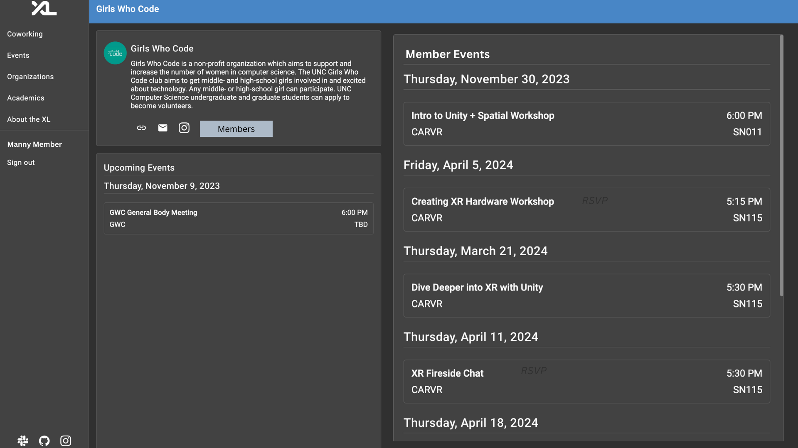

### You Can't Hate From Outside the Club (But You CAN Get In)

**Team Members:** Advika Ganesh, Erin Ma, Lalitha Vadrevu, Pallavi Sastry

## Overview

Student Organizations need a membership roster in order to organize their members and leadership database. We need to establish membership/leadership relationships with CSXL users. This will allow student organizations to post member-specific information to users. While some organizations might be open to all, there are many organizations (App Team, Girls Who Code, CS+SG) that host events and need to post information specific to members, so having this relationship established would allow organizations to easily convey information to their members. Many users are part of multiple organizations, so this would also allow them to access all of the information in one place.

Student Organizations need a membership roster in order to organize their members and leadership database. We need to establish membership/leadership relationships with CSXL users. This will allow student organizations to post member-specific information to users. While some organizations might be open to all, there are many organizations (App Team, Girls Who Code, CS+SG) that host events and need to post information specific to members, so having this relationship established would allow organizations to easily convey information to their members. Many users are part of multiple organizations, so this would also allow them to access all of the information in one place.

## Key Personas

1. Manny Member has the ability to view all the CS clubs, public events, can join open clubs and can see the application deadlines for certain clubs.Manny Member also has the ability to request membership into open organizations.As a member of a club, Member Manny also has the ability to view member-only events and announcements posted by their organizations.
2. Nancy Non-Member has the ability to view all the CS clubs, public events, can join open clubs and can see the application deadlines for certain clubs.Manny Member also has the ability to request membership into open organizations.
3. Rhonda Root as a leader/ Exec member of the club has the ability to accept or deny membership into their organization.Rhonda Root has the ability to remove members from their organizations as well as assign the level of membership to members within their organization.They have the ability to open or close their organization from accepting membership requests.They have the ability to change the term of membership applications as well as change the title of a member.(Eg:Presideny=t, Treasurer,etc) Lastly, they also have the ability to grant members with administrator-level access. They have the ability to create events and display them as member-only or open to all.

4. Manny Member has the ability to view all the CS clubs, public events, can join open clubs and can see the application deadlines for certain clubs.Manny Member also has the ability to request membership into open organizations.As a member of a club, Member Manny also has the ability to view member-only events and announcements posted by their organizations.
5. Nancy Non-Member has the ability to view all the CS clubs, public events, can join open clubs and can see the application deadlines for certain clubs.Manny Member also has the ability to request membership into open organizations.
6. Rhonda Root as a leader/ Exec member of the club has the ability to accept or deny membership into their organization.Rhonda Root has the ability to remove members from their organizations as well as assign the level of membership to members within their organization.They have the ability to open or close their organization from accepting membership requests.They have the ability to change the term of membership applications as well as change the title of a member.(Eg:Presideny=t, Treasurer,etc) Lastly, they also have the ability to grant members with administrator-level access. They have the ability to create events and display them as member-only or open to all.

## User Stories

Nancy Non-member AND Manny Member:

- Have the ability to view all CS clubs, public events, are able to join open clubs, and can see application deadlines for certain clubs.
- Ability to request membership into open organizations.

Manny Member:

- have the ability to view the members-only events and announcements posted by their organization.

Rhonda Root (Execs/Leaders):

- Permission to accept and deny membership into their organization.
- Remove members from their organizations.
- Assign membership level to members in their organization
- Permission to open/close organizations from accepting membership requests.
- Ability to change term of membership applications
- Ability to assign a title to member (president, treasurer)
- Ability to give member administrator-level access (toggle)
- The ability for an org to list its leaders (and members?) by academic term on their organization page

**Stretch Goals**

Rhonda Root:

- Ability to post about new events happening in the club.
- Ability to create member-only event RSVP forms.
  - Toggle (member-only/everyone)

Manny Member and Nancy non-member:

- RSVP to event.

Nancy Non-member AND Manny Member:

- Have the ability to view all CS clubs, public events, are able to join open clubs, and can see application deadlines for certain clubs.
- Ability to request membership into open organizations.

Manny Member:

- have the ability to view the members-only events and announcements posted by their organization.

Rhonda Root (Execs/Leaders):

- Permission to accept and deny membership into their organization.
- Remove members from their organizations.
- Assign membership level to members in their organization
- Permission to open/close organizations from accepting membership requests.
- Ability to change term of membership applications
- Ability to assign a title to member (president, treasurer)
- Ability to give member administrator-level access (toggle)
- The ability for an org to list its leaders (and members?) by academic term on their organization page

**Stretch Goals**

Rhonda Root:

- Ability to post about new events happening in the club.
- Ability to create member-only event RSVP forms.
  - Toggle (member-only/everyone)

Manny Member and Nancy non-member:

- RSVP to event.

## Wireframes/Mockups

### Rhonda Root

Rhonda Root has administrator access to Girls Who Code and Carolina Data Challenge

**Rhonda Root Organization View**

- As Rhonda Root, the **Member** button under the organization description will allow her to view all the members of Girls Who Code.
- A new section is added to view Membership Requests. Rhonda has the option to **Accept** or **Deny** Membership Requests using the buttons beside their name.
- There is also a toggle that allows Rhonda to control if the organization wants to accept or block new requests coming in for the semester.
- There is also a dropdown menu in the Requests section that allows Rhonda to view requests from the corrosponding semester
- 

**Rhonda Root Members View**

- Once Rhonda clicks the **Members** button, it will lead to a view page showing a roster of all of the member names in the Member list.
- There is also a edit button to let Rhonda edit the member information.
- There is also a view of all of the leaders in the club along with their positions. Rhonda can also edit the member information of the Leaders.
- The dropdown menu allows you to view members from different terms. Currently it is on Spring 2024
  

**Rhonda Root Member Editor View**

- Once Rhonda clicks the pencil icon to edit the member information it opens up a member information form where the admin can edit the details of the member.
- Rhonda can change a member into a leader and add their position title.
- Rhonda can also edit the term to indicate which term they are a member of.
- The Administrator toggle will allow the member to become administrator and have admin privilages.
  

**Rhonda Root Event Editor**

- When Rhonda decides to create an event, Rhonda can specify the event name, the date and location of the event, the event description, set registration limit, the organizers (execs) involved, and whether the event is an “members-only” event or “for anyone”.
  

### Nancy Non-Member

**Nancy Non-Member Members View**

- Nancy Non-Member has the ability to view the members and the execs/leaders of the organization.
- When Nancy clicks on the **Members** button, it will lead to a new view which shows a roster of all of the member names in the Member list as well as the members with leadership positions.
- This view is the same as Manny Member's Members View
  

**Nancy Non-Member Organization View**

- Nancy Non-Member sees a page view of the organization that displays the information and description of the organization as well as the general events.
- There is also a button to request membership into the club. If the club is no longer accepting members, it will be grayed out. The Members button will lead to a members
  

### Manny Member

**Manny Member Organization View**

- When Manny selects a club it will lead to a new page view with the description and information of the club
- Manny will see not only the general events but also the exclusive member events.
- 

## Technical Implementation Opportunities and Planning

### Existing Codebase

### Dependency

- Members: When members are accepted by the exec, we should be able to track and see the members from selected terms.

- Using existing codebase, we also rely on the authorization system to know who can edit/update certain member info or accept/deny requests.

- For keeping track of events for "members-only", we may be able to use the current event entity/model.

### Extensions

- Need to add new database tables and data schemas to store member and non-member information.

- Need to modify the frontend for Organization Details page to accommodate new features of member and non-member info.

### Page Components and Widgets

- User Admin Member Editor Component: New route to member so that admins can view/edit member info or remove member from organization.

- User Admin Member Component: Section of the organization details component on the organization page where admins can view members of specific terms and edit member info by clicking edit button. Members can remove a member from the organization by clicking the "Remove Member" button.

- User Admin New Events Component (modify existing event component): Form for creating new events for an organization including details about event name, location, date, etc. Add a toggle button to the form indicating whether the event is for all members or not.

- User Admin Request Non-Members Component: Section of the organization details component on the organization page where admins can view membership requests from non-members from current term

- User Admin Accept or Deny Non-Members Component: New route to request form from non-members, and option to either accept or deny non-member to the organization.

- Events Details (modifying existing events detail component) Widget: For each event widget, apart from listing details about the event, include an element to state whether the event is "member-only" or "for all".

### Models

- Members: Model used to store all the information necessary for a member. Encapsulates the member object associated with the organization, the member's name, onyen, term in college, and position in the organization.

- Events: Model used to store all the information necessary for an organization event. Encapsulates the event object associated with the organization, the event name, if member-only event or not, date, organizers.

- Membership Requests: Model used to store all the membership requests from non-members. Encapsulates the request object associated with the organization, the member name, term, date, organizers.

### API / Routes

- Get members (/organizations/{slug}/members): Returns roster of members. Used by Administrator personas

- Put members (/organizations/{slug}): Update membership. Used by admin personas

- Post members(/organizations/{slug}): Create members. Used by admin personas

- Post requests(/organizations/{slug}): Create membership requests. Used by admin personas

### Security and Privacy concerns

- Only administrators are able to edit membership and create events

- Exists a handoff of power at the end of every election cycle/semester/school year
